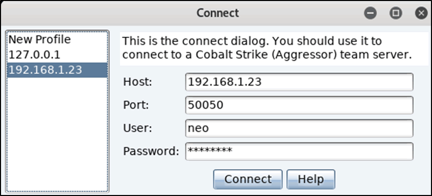
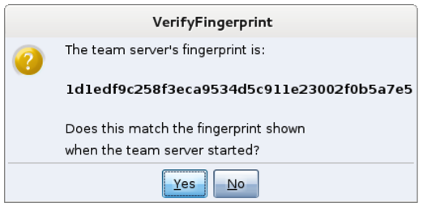
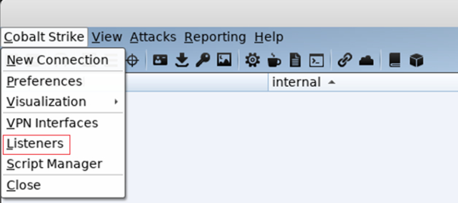
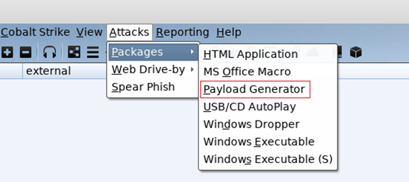
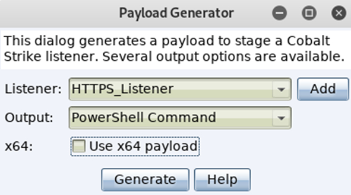
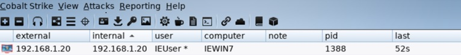
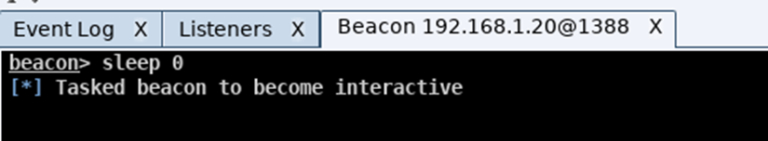

+++
title = "Cobalt Strike: Red Team's Best Friend"
date = "2020-11-06"
author = "Matthew Toms-Zuberec"
description = "Cobalt Strike is software for Adversary Simulations and Red Team Operations, and is the leading C2 framework in Red Team exercises conducted today. This guide will show you how to use it and will deomnstrate some of the many features it has."
+++

---------------------------------------------------------------------------
## Getting Started With Cobalt Strike

As an aspiring Red Teamer, I’ve recently started learning how to use Cobalt Strike, and thought it would be a good idea to write a blog post on using it, and the many features it includes. 

As some of you may be aware, Cobalt Strike is software for Adversary Simulations and Red Team Operations. Since 2012, Cobalt Strike has been utilized as a proactive way of testing network defenses against advanced threat actor tools, tactics, and procedures. In this post, I will quickly demonstrate how to get Cobalt Strike up and running on your system, setting up a listener, and interacting with a target machine.

>**Prerequisites:**
>- Cobalt Strike License
>- VMware or Virtualbox for the lab
>- Copy of Kali Linux
>- Copy of Windows 10 (Windows 7 will work as well)

## Start the Teamserver

The first step is to start the Cobalt Strike team server, as it is the C2 server that all compromised targets will beacon back to. It is also where you also connect to for managing and controlling your compromised targets.

For this tutorial/lab, I'll assume you already have a Cobalt Strike license, and we will be setting up the teamserver on your instance of Kali Linux. However, when on an engagement, you should avoid running the C2 server off your own machine, and should have a VPS or dedicated server. It is also good OPSEC to set up redirects/domain fronting while on an engagement, so that the blue team doesn't cripple your C2 by blocking the IP address or domain you are using.

You can start the team server using the following command:

```bash
./teamserver local-ip-address password-of-your-choice
```

#### Quick Breakdown of the command:
There are two (mandatory) arguments passed to the teamserver binary, the first being the IP address it should be hosted on, and the password you will use to authenticate with through the client. Now typically in most cases, the IP address you supply should be the external IP of your server, but for this exercise we will use the local IP address of your Kali Linux machine. The teamserver runs on port 50050 by default.

When the team server starts up, it will publish a SHA1 hash of the team server’s SSL certificate, which you can distribute to other team members so that they can connect.

## Starting the Client

The Cobalt Strike client connects to the team server, and provides us with a GUI to connect and manage the team server and any compromised hosts. The client can be started by running the following command on your Kali VM:
```bash
./cobaltstrike
```
A window similar to the image below should appear:



There are 4 self explanatory input fields: Host, Port, User, and Password. It should be noted that the "user" field is just a nickname, and is what will be displayed to other team members connected to the server.

In this case, you should put your local IP address as the host, choose a username, and enter the password. Then, click connect, and wait for the next prompt to appear.

Since this is your first time connecting to this teamserver on the Kali Linux box, you should be presented with a popup regarding verifying the hash of the server. Double check and make sure it matches the one from the teamserver. This is an important step to mitigate MITM attacks.



## Let the games begin

Now we can test out Cobalt Strike, so it's time for us to spin up our target Windows VM that we will run Cobalt Strike payloads in.

Just as a precation, take a snapshot of the Windows VM once it's running just in case you end up doing something further outside of this lab.

## Popping all the shells

Most likely you just want to see it raining shells if this is your first time using Cobalt Strike, so lets jump ahead to the fun stuff.

Before we can pop a shell, we need to setup a listener. A listener consists of a user-defined name, a payload, a host, a port, and whether or not you would like the payload to automatically migrate. 

## Listeners

Listeners are Cobalt Strike’s equivalent of Metasploits ```exploit/multi/handler``` module. It essentially sets up a server that waits for the payload on a compromised system to connect to you.

There are different types of listeners you can configure:

- Beacon DNS
- Beacon HTTP and HTTPS
- Beacon SMB
- Beacon TCP
- External C2
- Foreign HTTP and HTTPS

For this exercise we will stick with the ```windows/beacon_https/reverse_https``` as it is quick and simple.



Fill in the rest of requirements for this new listener by giving it an easily identifiable name, adding the IP address of your team server, and the port is should receive connections on. Then click save.

Next you will be prompted for a domain. Since this is an internal lab use you can use an IP address, however while on an engagement you should supply a domain.

We are now ready to create the payload. For testing purposes, I reccomend you disable Windows Defender and any other AV's you may have installed on it.

## Beacons
- Cobalt Strike's Payload
- Two Main Communication Methods:
    - Asynchronous (low and slow)
    - Interactive (realtime control)
- Uses either HTTP/S or DNS
- Uses SMB or TCP for p2p (peer-to-peer) C2
- Remote Administration Tool Features

Cobalt Strike comes with a vast payload creation offering, as it covers almost all commonly used techniques, which are incredibly simple to build. Unfortunately, (or fortunately depending on your situation), all common AV software has a signature for each one of the available payloads. Lucky for us, we can use various tools such as Unicorn by Dave Kennedy of TrustedSec to obfuscate the payloads.

Another quick note about Beacons, is that they have easily identifiable network indicators, however they are malleable so they can be changed to avoid detection. Do not use a raw Cobalt Strike payload on an engagement, it will most definitely raise flags for the Blue Team.

**To build a Cobalt Strike payload, click on Attacks -> Packages -> Payload Generator**



Choose the listener you want the payload to call back to, followed by the output format for the payload. For this demo we will use the PowerShell Command option. It creates a nice PowerShell oneliner, which can be copied into command prompt or powershell, and then executed.



Once you have generated the payload, open it using a text editor (nano and vi/vim mess with the formatting so avoid it for now), and copy the command to your clipboard.

Switch over to your Windows VM and paste the command into command prompt and hit enter, or open up the run dialogue box by pressing WIN + R, and executing it there.

A few seconds later you should see the Windows VM call back to the C2, and you should receive your session as seen below.



To be able to send shell commands to the target you have to enable interactive mode. This can be done by clicking on the chosen target and selecting "Interact". This will open a new tab and then you can execute commands via the beacon prompt. You will likely spend most of your time with Cobalt Strike in the Beacon console. It’s worth your time to become familiar with the commands Cobalt Strike has to offer. Type **help** in the Beacon console to see available commands.

During an engagement, you can control the rate at which you communicate with the target host. Most often you intentionally slow communication down in an attempt to reduce the chances of being spotted by the blue team. However while working in a lab environment, you may find the slow responses to requests frustrating, so you can set the beacon to respond instantly by typing in ```sleep 0``` and pressing enter.



It should be noted that all cmd/powershell commands can be used natively within beacon, but to do so you have to put the word “shell” before each command so that the beacon is able understand your request.

## A Few Useful Features

### Screenshot

The screenshot function allows you to take a snapshot of the target machine's Desktop. To take a screenshot, right click on the compromised host and naviagte to Explore -> Screenshot, or just type ```screenshot``` in the beacon prompt and hit enter.

### List all running processes

To view the list of running processes on the target, right click on the host, and select Explore -> Process List. A tab will open detailing the running processes, and if you want to inject into another process (say you find a process running as SYSTEM for example), highlight the process you want to inject into, and then you will then be prompted to choose the listener you want to use. In this case you can just reuse the same listener we created earlier.

### Privilege Escalation

Cobalt Strike has a few methods for privesc. You can use the ```bypassuac``` command which runs the Bypass UAC attack on the target. Use this if your compromised user is a local admininistrator, but you’re in a medium integrity context. Otherwise, the ```spawnas``` command will suffice as it lets you use known credentials to spawn a session as another user. PowerUp works well with Beacon’s powershell and powerpick commands too.

### Harvesting Creds

Some metasploit modules never die :) 

You can run the command ```hashdump``` to recover local account hashes. Used most effectively/best once elevated.

You can also use the command ```logonpasswords``` to harvest credentials via mimikatz. That and ```mimikatz``` is available to run as a command or through View -> Credentials.

### Network Recon

The command ```portscan``` runs the Cobalt Strike Beacon’s built-in port scanner. The command ```net computers``` maps computer accounts in the domain’s Domain Computers group to IP addresses. PowerView works well with the Beacon’s powershell and powerpick commands as well. You can view known host and service information under View -> Targets.

### Lateral Movement

There are multiple commands for lateral movement, including: ```psexec```, ```psexec_psh```, ```winrm```, and ```wmi```. All of the commands accept a target and listener name. The ```psexec``` command requires that you specify a share, as it drops an executable to that share.

While these commands are nice, it can be easier in some cases to do lateral movement by hand as it gives more flexibility.

**— MTZ**    

